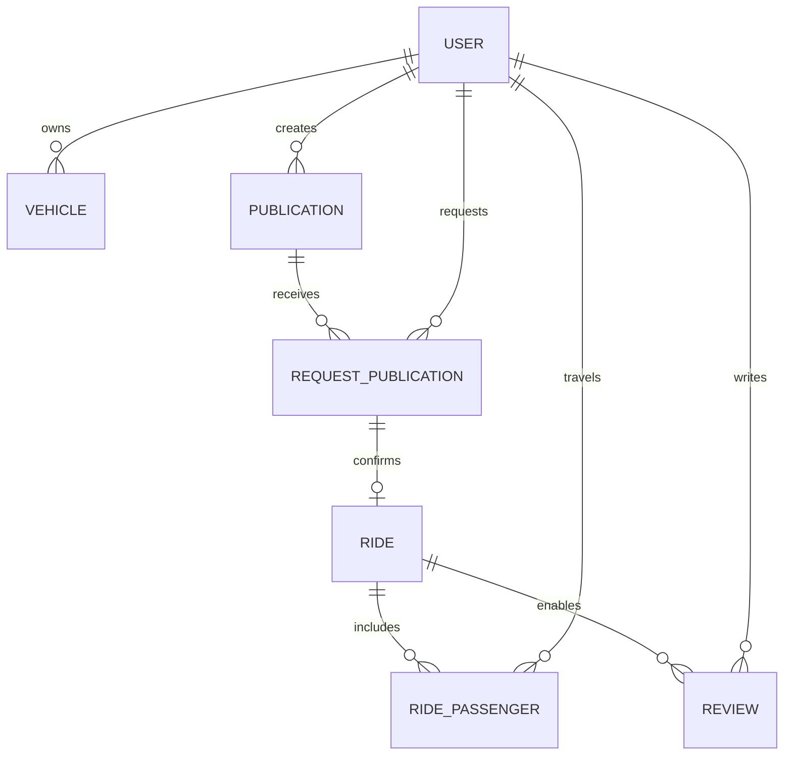

# Carpool UTEC

[](https://classroom.github.com/a/qZKM4_z6)

API REST para coordinar viajes compartidos entre estudiantes de la Universidad de Ingenieria y Tecnologia (UTEC). El proyecto busca facilitar que los estudiantes que se movilizan hacia o desde el campus puedan ofrecer asientos disponibles o solicitar un traslado, manteniendo un registro de solicitudes, viajes confirmados y calificaciones.

## Informacion Del Proyecto

| Campo | Detalle |
| --- | --- |
| Curso | Desarrollo Basado en Plataformas - CS 2031 |
| Periodo | 2026-1 |
| Proyecto | Carpool UTEC |
| Backend | Spring Boot |
| Repositorio de entrega | [GitHub Classroom](https://github.com/CS2031-DBP/proyecto-1-caarpiolutec) |

### Integrantes

| Nombre | Codigo |
| --- | --- |
| Leonardo Daniel Panduro Chinchay | 202520231 |
| Ary Fernando Sanchez Cerna | 201920061 |
| Walter Sebastian Aquino Pachas | 202410070 |
| Franco Andres Tapia Retamozo | 202210345 |
| Jose Ernesto Guerrero Cueva | Por confirmar |

## Problema Que Atiende

El transporte hacia la universidad puede ser costoso o poco practico. Algunos estudiantes llegan en auto con asientos libres; Carpool UTEC vincula ambos casos dentro de una comunidad identificada mediante correo institucional.

La aplicacion no considera que un estudiante sea siempre conductor o siempre pasajero. Un mismo usuario puede ofrecer un viaje en una ocasion y solicitar movilidad en otra, dependiendo de su necesidad y de si dispone de un vehiculo registrado.

## Funcionalidades Principales

La API permite registro y login JWT, vehiculos propios, publicaciones, solicitudes, aceptacion que genera viajes, reviews entre participantes e integracion geografica con Google Maps. Ademas, notifica el registro y cambios de solicitudes.

## Flujo Principal Del Sistema

1. Un estudiante se registra con su correo UTEC e inicia sesion.
2. Si desea ofrecer transporte, registra un vehiculo propio indicando su capacidad.
3. El usuario crea una publicacion:
   - Como conductor, publica asientos disponibles y selecciona uno de sus vehiculos.
   - Como pasajero, publica la cantidad de asientos que necesita.
4. Otro estudiante responde a la publicacion con una solicitud compatible:
   - Una publicacion de conductor recibe solicitudes de pasajeros.
   - Una publicacion de pasajero recibe solicitudes de conductores.
5. El autor de la publicacion revisa sus solicitudes recibidas y acepta o rechaza una solicitud pendiente.
6. Al aceptar, el backend identifica al conductor, al pasajero y al vehiculo correspondiente, y crea el viaje confirmado.
7. Los participantes consultan el viaje y luego pueden registrar una calificacion.

El viaje se crea desde una solicitud aceptada, manteniendo la relacion entre publicacion, solicitud y participantes.

## Modelo De Datos

| Entidad | Responsabilidad |
| --- | --- |
| `User` | Representa al estudiante registrado, sus credenciales, rol del sistema y rating calculado. |
| `Vehicle` | Vehiculo perteneciente a un usuario, utilizado cuando participa como conductor. |
| `Publication` | Publicacion de un estudiante que ofrece asientos o solicita transporte. |
| `RequestPublication` | Solicitud realizada sobre una publicacion y su estado de aprobacion. |
| `Ride` | Viaje confirmado despues de aceptar una solicitud valida. |
| `RidePassenger` | Relacion entre el viaje confirmado y el pasajero participante. |
| `Review` | Calificacion realizada entre participantes de un viaje concluido. |

Las entidades se relacionan mediante JPA para conservar la trazabilidad del flujo.



## Reglas De Negocio

### Usuarios Y Seguridad

- El registro admite correos con dominio institucional `@utec.edu.pe`.
- Las contrasenas se almacenan codificadas con BCrypt.
- La autenticacion genera access token y refresh token.
- Los roles del sistema son `USER` y `ADMIN`.
- Ser conductor o pasajero depende de cada viaje y no de un rol permanente.
- Los recursos sensibles se asocian al usuario obtenido desde el JWT.

### Vehiculos Y Publicaciones

- Cada vehiculo queda asociado al usuario autenticado que lo registra.
- Solo el propietario puede modificar o eliminar su vehiculo.
- Para publicar como conductor, el usuario debe utilizar un vehiculo propio.
- Los asientos ofrecidos no pueden superar la capacidad del vehiculo.
- Una publicacion de pasajero no asigna vehiculo, porque el conductor se determinara al recibir una solicitud valida.

### Solicitudes Y Cupos

- Un usuario no puede solicitar su propia publicacion.
- Una solicitud debe tener el sentido opuesto al de la publicacion original.
- El conductor que responde a una publicacion debe contar con vehiculo valido.
- Solo se pueden aceptar, rechazar o cancelar solicitudes que se encuentren pendientes.
- El solicitante puede cancelar y el autor de la publicacion puede aceptar o rechazar.
- Al aceptar se verifican nuevamente cupos y capacidad del vehiculo.

### Reviews Y Rating

- Solo un participante autenticado puede registrar una review de otro participante, una vez por viaje.
- El rating mostrado para un usuario se obtiene de sus reviews y no es un valor que el usuario pueda asignarse directamente.

## Arquitectura Del Backend

El backend mantiene una arquitectura por capas sencilla, apropiada para el alcance del curso. Una peticion protegida atraviesa primero el filtro JWT; luego el controlador recibe DTOs y delega la operacion al servicio. La logica de carpool vive en servicios, no en controladores: por ejemplo, `RequestPublicationService` valida ownership, tipo conductor/pasajero, cupos y genera `Ride` al aceptar una solicitud.

```text
Cliente HTTP
   -> SecurityConfig / JwtAuthenticationFilter
   -> Controller (rutas, DTOs y @Valid)
   -> Service (reglas, ownership y eventos)
   -> Repository (Spring Data JPA)
   -> Model (entidades PostgreSQL)
```

| Capa o paquete | Clases representativas | Responsabilidad |
| --- | --- | --- |
| `controller` | `AuthController`, `PublicationController`, `RequestPublicationController` | Expone rutas HTTP y entrega respuestas DTO. |
| `service` | `AuthService`, `PublicationService`, `RequestPublicationService`, `ReviewService` | Aplica reglas, permisos del usuario autenticado y creacion del viaje. |
| `repository` | `UserRepository`, `PublicationRepository`, `RideRepository` | Consulta y persiste entidades mediante JPA. |
| `model` | `User`, `Vehicle`, `Publication`, `RequestPublication`, `Ride`, `Review` | Representa los datos y relaciones del dominio. |
| `security` | `JwtAuthenticationFilter`, `JwtService`, `SecurityConfig` | Autentica tokens y protege endpoints sensibles. |
| `exception` y `dto` | `RestExceptionHandler`, `ErrorResponseDto` | Define validaciones y errores HTTP consistentes. |
| `event` y `listener` | `UserRegisteredEvent`, `RequestStatusChangedListener` | Procesa notificaciones asincronas sin mezclar correo con el flujo principal. |

## Tecnologias Utilizadas

| Tecnologia | Uso En El Proyecto |
| --- | --- |
| Java 17+ | Lenguaje de desarrollo |
| Spring Boot | Construccion de la API REST |
| Spring Data JPA | Acceso y persistencia de datos |
| PostgreSQL | Base de datos relacional |
| Spring Security | Autenticacion y autorizacion |
| JWT | Tokens de acceso para endpoints protegidos |
| BCrypt | Proteccion de contrasenas |
| Testcontainers | Base PostgreSQL aislada para pruebas |
| JUnit y Mockito | Pruebas automatizadas |
| Google Maps API | Consulta de rutas y coordenadas |
| JavaMailSender | Envio de correos y notificaciones |
| Docker | Ejecucion local de PostgreSQL y preparacion para despliegue |
| Spring Boot Actuator | Endpoint de salud utilizado por Docker y AWS ECS/ALB |

## Endpoints Principales

| Metodo | Ruta | Descripcion | Acceso |
| --- | --- | --- | --- |
| `POST` | `/api/auth/register` | Registra un estudiante | Publico |
| `POST` | `/api/auth/login` | Inicia sesion y retorna tokens | Publico |
| `POST` | `/api/auth/refresh` | Renueva el access token | Publico |
| `GET` | `/api/publications` | Lista publicaciones disponibles | Publico |
| `POST` | `/api/publications` | Crea una publicacion | Autenticado |
| `POST` | `/api/vehicles` | Registra un vehiculo propio | Autenticado |
| `POST` | `/api/request-publications` | Crea una solicitud | Autenticado |
| `PATCH` | `/api/request-publications/{id}/accept` | Acepta una solicitud | Autor de la publicacion |
| `GET` | `/api/rides` | Consulta viajes confirmados | Autenticado |
| `POST` | `/api/reviews` | Califica a un participante del viaje | Autenticado |
| `GET` | `/api/users/me` | Consulta el perfil y rating propios | Autenticado |
| `GET` | `/api/users/{id}` | Consulta el usuario y su rating calculado | Administrador |
| `GET` | `/actuator/health` | Verifica disponibilidad del backend | Publico |

Las rutas de viajes y pasajeros se utilizan para consulta del flujo confirmado. La creacion de estas entidades ocurre durante la aceptacion de solicitudes.

## Integracion Con Google Maps

La aplicacion obtiene coordenadas y distancias para publicaciones y viajes. La clave se configura por variable de entorno.

```powershell
$env:GOOGLE_MAPS_API_KEY="TU_CLAVE_DE_GOOGLE_MAPS"
```

En el deploy se habilitan Geocoding API y Distance Matrix API mediante un secreto.

## Ejecucion Local

### Requisitos

- Java 17 o superior.
- Docker Desktop en ejecucion.
- PowerShell en Windows.
- Postman para probar el flujo de la API.

### 1. Preparar Variables Locales

El archivo `.env.example` es la referencia local; su copia `.env` no se versiona.

```powershell
Copy-Item .env.example .env
```

La configuracion local requerida incluye:

```dotenv
POSTGRES_DB=carpultec
POSTGRES_USER=<USUARIO_LOCAL>
POSTGRES_PASSWORD=<PASSWORD_LOCAL>
SPRING_DATASOURCE_URL=jdbc:postgresql://db:5432/carpultec
SPRING_DATASOURCE_USERNAME=<USUARIO_LOCAL>
SPRING_DATASOURCE_PASSWORD=<PASSWORD_LOCAL>
APP_JWT_SECRET=<SECRET_BASE64_LOCAL>
GOOGLE_MAPS_API_KEY=<CLAVE_LOCAL_DE_GOOGLE_MAPS>
CORS_ORIGINS=http://localhost:3000,http://localhost:5173
```

### 2. Ejecutar La Aplicacion Con Docker

```powershell
docker compose up --build
```

Docker Compose inicia PostgreSQL y el backend. La API queda disponible en:

```text
http://localhost:8080
```

Las contrasenas, tokens y claves de APIs no deben almacenarse en el repositorio.

## Pruebas Automatizadas

Las pruebas cubren repositorios, servicios, controladores, seguridad y Google Maps. Persistencia utiliza PostgreSQL con Testcontainers, por lo que Docker debe estar activo.

```powershell
.\mvnw.cmd test
```

En la revision funcional previa al despliegue se obtuvo:

```text
Tests run: 201, Failures: 0, Errors: 0, Skipped: 0
BUILD SUCCESS
```

## Pruebas Con Postman

`postman_collection.json` se importa en Postman y su variable `baseUrl` permite probar localmente o contra AWS.

Para ejecutar el recorrido principal:

1. Registrar al conductor y al pasajero con correos `@utec.edu.pe`.
2. Iniciar sesion con ambos usuarios y obtener sus tokens JWT.
3. Registrar el vehiculo del conductor.
4. Crear una publicacion como conductor.
5. Enviar una solicitud como pasajero.
6. Aceptar la solicitud desde la cuenta del conductor.
7. Consultar el viaje, registrar una review y verificar el rating.
8. Ejecutar controles de seguridad para respuestas `401` y bloqueo de creacion manual de viajes.

Para probar AWS, la variable de la coleccion debe quedar asi cuando se disponga de la URL final:

```text
baseUrl = http://carpultec-alb-1825260446.us-east-1.elb.amazonaws.com
```

## Despliegue En AWS Academy

El despliegue de entrega se realizo en AWS Academy Learner Lab. El primer despliegue se configuro manualmente para validar los recursos iniciales y la conectividad entre el balanceador, ECS Fargate y RDS. El repositorio incluye un workflow manual para construir una nueva imagen Docker, publicarla en Amazon ECR y actualizar la tarea de Amazon ECS sin sobrescribir las variables sensibles almacenadas en Parameter Store.

| Recurso | Configuracion |
| --- | --- |
| Entorno de entrega | AWS Academy Learner Lab |
| Region AWS | `us-east-1` |
| Amazon ECR | `carpultec-api` |
| Cluster ECS | `carpultec-cluster` |
| Servicio ECS | `carpultec-service` |
| Base de datos RDS | `carpultec-db` |
| URL publica de la API | `http://carpultec-alb-1825260446.us-east-1.elb.amazonaws.com` |
| CI/CD | Workflow manual `Deploy to AWS Academy ECS` disponible desde `main` |

Las credenciales de base de datos, la clave JWT y las configuraciones privadas de integracion se proporcionan al contenedor mediante parametros seguros de AWS. El balanceador consulta `/actuator/health` para confirmar que la aplicacion inicio correctamente antes de dirigir trafico. El target group se valido en estado `healthy` con el backend accesible desde la URL publica.

El workflow de GitHub Actions fue validado para ejecutar pruebas, construir la imagen Docker, publicarla en ECR y actualizar ECS. Se ejecuta manualmente debido al uso de credenciales temporales de AWS Academy.

